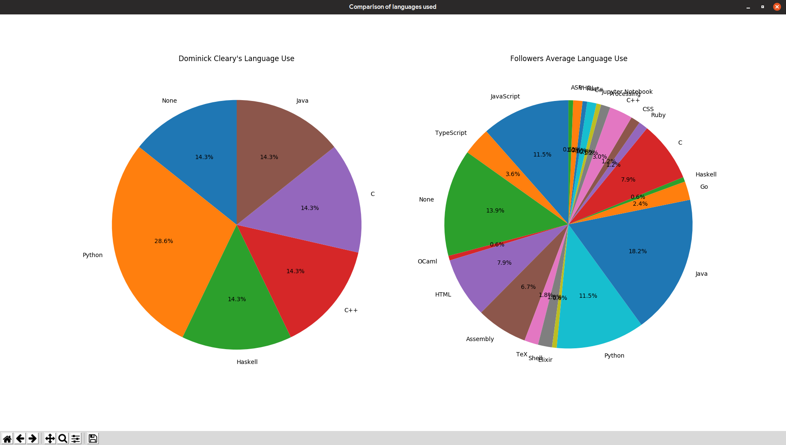
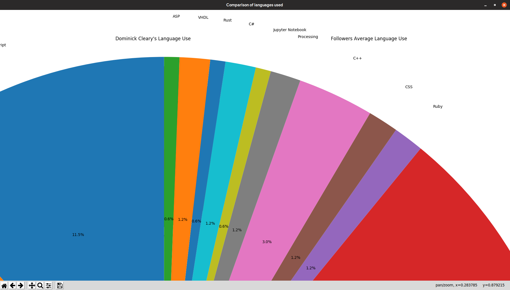
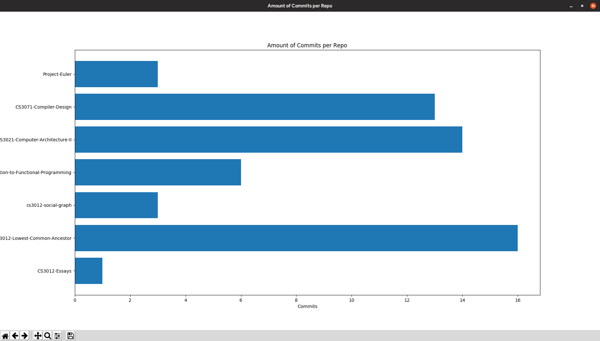
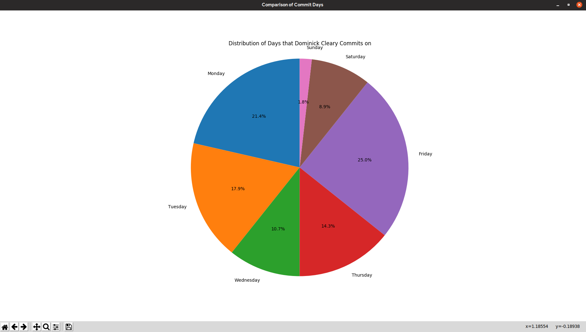

# cs3012-social-graph

The user logs in through the terminal window using their Username & Password or a personal access token. The project in written in Python and uses PyGithub to pull data and MatPlotLib to display it.

The first graph is a pie charts that compares the languages used in the logged in users repos to that of their followers.

If individual slices are too small to see they can be zoomed in on for easier viewing

The second graph shows the amount of commits in each repo of the logged in user

The final graph shows the days that the logged in user commits on in percentages

